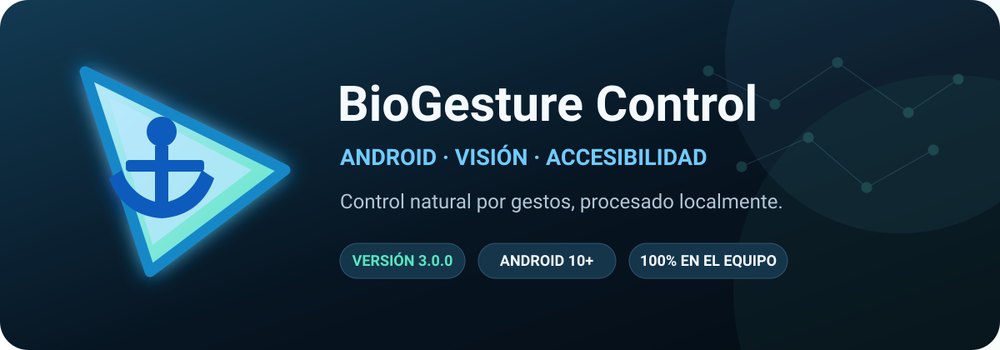

# BioGesture Control Android

**Controla un dispositivo Android mediante gestos de una mano en tiempo real.**
CameraX + MediaPipe + una máquina de estados determinista + Accesibilidad de Android.

 

[**Descargar APK estable**](https://github.com/Luics415/Bio-Gesture-Control-Android/releases/latest) ·
[**Manual de usuario**](docs/MANUAL_DE_USUARIO.md) ·
[**Pruebas en teléfono**](docs/PRUEBAS_EN_TELEFONO.md) ·
[**Reportar un problema**](https://github.com/Luics415/Bio-Gesture-Control-Android/issues)

---

## En una frase

BioGesture convierte los 21 landmarks de una mano detectados por la cámara frontal en un cursor, clics, arrastre continuo, acciones contextuales, reposo y un menú radial completo, sin enviar la imagen fuera del teléfono.

> [!IMPORTANT]
> La instalación recomendada es la APK firmada de **GitHub Releases**. No descargues copias desde sitios de terceros. Verifica la suma SHA-256 incluida en cada release.

## Capturas reales

<table>
  <tr>
    <th>Panel final · vertical</th>
    <th>Panel final · horizontal</th>
  </tr>
  <tr>
    <td></td>
    <td></td>
  </tr>
  <tr>
    <th>Seguimiento de mano</th>
    <th>Menú radial</th>
  </tr>
  <tr>
    <td></td>
    <td></td>
  </tr>
</table>

Las capturas de funcionamiento provienen de pruebas físicas del proyecto. El diagnóstico de landmarks es opcional y puede ocultarse durante el uso normal.

## Tabla de contenidos

- [Qué resuelve](#qué-resuelve)
- [Versión 3.0.0](#versión-300)
- [Compatibilidad](#compatibilidad)
- [Instalación del APK](#instalación-del-apk)
- [Primeros cinco minutos](#primeros-cinco-minutos)
- [Gestos](#gestos)
- [Menú radial](#menú-radial)
- [Calibración y orientación](#calibración-y-orientación)
- [Rendimiento y temperatura](#rendimiento-y-temperatura)
- [Arquitectura](#arquitectura)
- [Privacidad, permisos y seguridad](#privacidad-permisos-y-seguridad)
- [Compilar desde código](#compilar-desde-código)
- [Calidad y validación](#calidad-y-validación)
- [Solución de problemas](#solución-de-problemas)
- [La versión antigua](#la-versión-antigua)
- [Proyecto para PC](#proyecto-para-pc)
- [Licencia y autoría](#licencia-y-autoría)

---

## Qué resuelve

Controlar Android desde una cámara no consiste únicamente en dibujar puntos sobre una mano. Un sistema utilizable necesita resolver cinco problemas simultáneos:

1. **Visión:** conservar la mano durante movimiento, oclusión leve y cambios de luz.
2. **Coordenadas:** rotación, cámara frontal, espejo, orientación, barras e insets deben coincidir.
3. **Intención:** una pinza breve debe ser clic; la misma pinza sostenida debe ser arrastre; una lectura ambigua no debe hacer nada.
4. **Continuidad:** perder uno o dos fotogramas no puede soltar un objeto ni cerrar un menú.
5. **Costo:** el análisis debe responder sin mantener innecesariamente el teléfono a máxima carga.

BioGesture 3.0.0 trata cada problema en una capa independiente y verificable.

## Versión 3.0.0

La 3.0.0 es la primera entrega estable del núcleo Android rediseñado.

### Visión y coordenadas

- CameraX en cámara frontal con análisis RGBA 640 × 480.
- MediaPipe Hand Landmarker 0.10.26.1 en modo video y una mano.
- Confianzas 0.55 de detección, 0.55 de presencia y 0.50 de seguimiento.
- Normalización explícita para ROTATION_0, 90, 180 y 270.
- Movimiento vertical natural y handedness correcto.
- Espejo aplicado exactamente una vez y configurable.
- Épocas de coordenadas para descartar fotogramas anteriores a una rotación.
- Insets y áreas seguras para barras, recortes y horizontal.

### Gestos

- Pinza **4–8** con histéresis para clic y arrastre.
- Arrastre continuo mediante trazos enlazados de Accesibilidad.
- Pinza **4–12** para contexto o pulsación larga.
- V sostenida tres segundos para reposo y reactivación.
- Gracia de 350 ms para pérdidas breves durante arrastre o menú.
- Cancelación inmediata de candidatos incompletos para impedir clics fantasma.
- Lecturas ambiguas bloqueadas hasta liberar.

### Menú radial

- Apertura intencional mediante pose de pulgar durante 800 ms.
- Navegación modal: no exige conservar la pose estricta después de abrir.
- Selección por permanencia de 750 ms.
- Arco de progreso, pulgar filtrado y centro de recentrado visible.
- Siete submenús tipados; no existen sectores vacíos.
- Enclavamiento: cada acción requiere volver al centro antes de repetirse.
- Geometría adaptada automáticamente a vertical, horizontal, esquinas e insets.

### Rendimiento

- Presupuestos de 12, 20 y 30 FPS.
- 6 FPS durante reposo.
- Reducción automática ante temperatura moderada o severa.
- Negociación del rango de captura soportado por el fabricante.
- Reutilización de buffers y preview únicamente al calibrar.
- Tres reintentos acotados ante fallos de cámara.
- R8 y reducción de recursos en el APK release.

### Experiencia

- Panel Material oscuro con estado real de cámara y Accesibilidad.
- Perfil seleccionable con controles segmentados.
- Interfaz de dos columnas creada específicamente para horizontal.
- Nuevo icono y ancla compacta sobre el landmark 8.
- Manual completo, política de privacidad, seguridad, arquitectura y avisos legales.

Consulta el detalle cronológico en [CHANGELOG.md](CHANGELOG.md).

---

## Compatibilidad

| Elemento | Requisito |
|---|---|
| Android | 10 o posterior (minSdk 29) |
| Target | Android API 36 |
| Cámara | Frontal obligatoria |
| Arquitectura | La compatible con las bibliotecas nativas incluidas por MediaPipe |
| Orientación | Vertical y horizontal |
| Entrada | Una mano |
| Conectividad | No requerida para el control |
| Cuenta | No requerida |
| Play Store | No; distribución oficial mediante GitHub Releases |

La compatibilidad de una acción contextual, web o multimedia también depende de lo que la aplicación activa publique mediante Accesibilidad o de las teclas multimedia que acepte.

---

## Instalación del APK

### Opción recomendada — GitHub Releases

1. Abre la [release más reciente](https://github.com/Luics415/Bio-Gesture-Control-Android/releases/latest).
2. Descarga **BioGesture-Control-v3.0.0.apk**.
3. Descarga **BioGesture-Control-v3.0.0.sha256**.
4. Comprueba el hash.
5. Abre la APK y permite la instalación desde esa fuente.
6. Concede cámara.
7. Activa BioGesture en Accesibilidad.
8. Calibra vertical y horizontal.

En Windows:

~~~powershell
Get-FileHash .\BioGesture-Control-v3.0.0.apk -Algorithm SHA256
~~~

### Ajustes restringidos

Android puede bloquear Accesibilidad para aplicaciones instaladas fuera de una tienda. Si BioGesture aparece atenuado o “bloqueado para proteger el dispositivo”:

1. abre **Ajustes → Aplicaciones → BioGesture Control**;
2. abre el menú de tres puntos;
3. selecciona **Permitir ajustes restringidos**, si aparece;
4. confirma tu identidad;
5. vuelve a Accesibilidad y activa el servicio.

Los nombres cambian según fabricante. El procedimiento completo, incluidos Vivo/Funtouch OS y actualizaciones desde una compilación 2.x, está en el [manual](docs/MANUAL_DE_USUARIO.md#3-instalación-paso-a-paso).

### APK y firma

La APK oficial se publica como asset, no dentro del historial Git. Cada release incluye:

- APK release firmada;
- SHA-256;
- notas de versión;
- código fuente generado por GitHub.

La clave de firma no se publica. Conservar la misma clave permite actualizar versiones oficiales sin perder ajustes.

---

## Primeros cinco minutos

1. Abre BioGesture.
2. Pulsa **Conceder acceso a la cámara**.
3. Pulsa **Activar BioGesture** y habilita el servicio.
4. Regresa y confirma **Sistema listo**.
5. Elige **20 FPS**.
6. Activa temporalmente los 21 puntos.
7. Inicia calibración vertical y recorre las cuatro esquinas durante seis segundos.
8. Gira el teléfono y calibra horizontal.
9. Mueve la mano: la punta del ancla debe coincidir con el índice.
10. Prueba una pinza 4–8 breve y después un arrastre sostenido.

> [!TIP]
> Usa luz frontal uniforme, evita una ventana detrás de la mano y conserva pulgar, índice y palma dentro del encuadre.

---

## Gestos

Los números son landmarks de MediaPipe: pulgar **4**, índice **8** y medio **12**.

| Función | Activación | Confirmación y resultado |
|---|---|---|
| Mover cursor | Mano visible | El punto 8 dirige la punta del ancla. |
| Clic principal | Pinza 4–8 | Mantener 60–299 ms y separar. Produce un toque. |
| Arrastre | Pinza 4–8 | Mantener 300 ms; mover sin separar; liberar para soltar. |
| Contexto | Pinza 4–12 | Mantener 100 ms. Ejecuta contexto o pulsación larga una vez. |
| Reposo | V | Sostener tres segundos. Bloquea controles y reduce a 6 FPS. |
| Reactivar | Liberar y repetir V | Sostener tres segundos. Restaura el perfil. |
| Menú radial | Pulgar extendido y otros dedos cerrados | Sostener 800 ms. |
| Elegir sector | Mover el pulgar | Mantener 750 ms y regresar al centro antes de otra acción. |
| Cerrar menú | BACK, V o pérdida sostenida | Cierra sin emitir clic residual. |

### Por qué 4–8 para arrastrar

La pinza índice–pulgar ofrece mejor control espacial en Android: el mismo índice que posiciona el ancla mantiene la trayectoria durante el arrastre. La distancia se normaliza por el tamaño de la palma, de modo que el umbral no depende directamente de cuánto ocupa la mano en la imagen.

### Reposo real

Reposo no desactiva completamente la cámara: conserva un presupuesto de 6 FPS para reconocer la V de reactivación. Todos los demás controles permanecen bloqueados.

---

## Menú radial

### PRINCIPAL

| Nivel | Contenido |
|---|---|
| CONFIG | AJUSTES, PERMISOS, GESTOS, CALIBRAR, VOLVER |
| EDIT | COPIAR, PEGAR, TODO, CORTAR, VOLVER |
| WEB | ATRAS, ADELANTE, SCROLL UP, SCROLL DN, NUEVA T, RECARGAR, CERRAR T, VOLVER |
| MEDIA | PLAY/PAUSE, SIGUIENTE, ANTERIOR, FULLSCREEN, ADELAN 10s, ATRAS 10s, VOLVER |
| PLAY | PLAY, PAUSE, VOLVER |
| VOLUME | SUBIR, BAJAR, MUTE, VOLVER |
| NAV | ATRAS, INICIO, RECIENTES, NOTIF, VOLVER |
| BACK | Cerrar menú |

### Volumen verificado

SUBIR y BAJAR fijan directamente un índice real de STREAM_MUSIC. Después de 120 ms la aplicación vuelve a leer el nivel y muestra el porcentaje efectivo. MUTE conserva el nivel anterior para restaurarlo. Si Android rechaza el cambio, BioGesture lo informa.

El mapa completo y las limitaciones por aplicación están en el [capítulo 9 del manual](docs/MANUAL_DE_USUARIO.md#9-menú-radial-y-submenús).

---

## Calibración y orientación

La calibración de seis segundos recoge el recorrido alcanzable del índice y calcula minX, maxX, minY y maxY. Descarta el 5% extremo, exige al menos 24 muestras y un recorrido mínimo. Una calibración inválida nunca reemplaza la anterior.

Vertical y horizontal se guardan por separado. Durante una rotación se cancela cualquier interacción modal, se cambia la época de coordenadas y se cargan los límites de la nueva orientación.

---

## Rendimiento y temperatura

| Estado | Presupuesto |
|---|---:|
| Ahorro | 12 FPS |
| Equilibrado | 20 FPS |
| Precisión | 30 FPS |
| Térmico moderado | Hasta 10 FPS o la mitad del perfil |
| Térmico severo | 6 FPS |
| Reposo | 6 FPS |

El análisis es local y utiliza CPU. Una resolución mayor que 640 × 480 incrementaría conversiones y memoria sin una mejora proporcional para un solo Hand Landmarker en este caso de uso.

---

## Arquitectura

~~~mermaid
flowchart LR
    Camera[CameraX frontal 640×480 RGBA] --> Transform[Rotación + época]
    Transform --> MediaPipe[MediaPipe 21 landmarks]
    MediaPipe --> Pose[HandPose normalización por palma]
    Pose --> Engine[GestureEngine máquina de estados]
    Engine --> Effects[GestureEffect]
    Effects --> Access[Accessibility toque, drag y globales]
    Effects --> Overlay[Ancla, esqueleto y menú radial]
~~~

| Componente | Responsabilidad |
|---|---|
| HandTrackingPipeline | Cámara, buffers, presupuesto térmico e inferencia. |
| LandmarkCoordinateTransform | Orientación del buffer a pantalla. |
| ScreenCoordinateMapper | Calibración, espejo, insets y píxeles. |
| HandPoseClassifier | V y pose de menú mediante geometría relativa. |
| GestureEngine | Estado puro de clic, arrastre, contexto, reposo y menú. |
| AccessibilityGestureDispatcher | Serialización segura de gestos Android. |
| RadialMenuController | Niveles, permanencia, recentrado y geometría. |
| BioGestureService | Integración, overlays, audio, rotación y ciclo de vida. |
| MainActivity | Onboarding, estado y configuración. |

Lee [docs/ARQUITECTURA.md](docs/ARQUITECTURA.md) para invariantes, hilos y transiciones.

---

## Privacidad, permisos y seguridad

| Capacidad | Uso |
|---|---|
| CAMERA | Obtener fotogramas de la cámara frontal. |
| FOREGROUND_SERVICE_CAMERA | Mantener detección visible en primer plano. |
| BIND_ACCESSIBILITY_SERVICE | Declarar el servicio protegido por Android. |
| MODIFY_AUDIO_SETTINGS | Cambiar volumen multimedia. |
| Recuperar ventanas | Localizar controles compatibles y foco de texto. |
| Realizar gestos | Toque, arrastre, swipe y acciones globales. |

No hay permiso de Internet en el manifiesto. Los botones Manual y GitHub delegan un enlace al navegador externo.

Consulta:

- [Política de privacidad](PRIVACY.md)
- [Política de seguridad](SECURITY.md)
- [Avisos de terceros](THIRD_PARTY_NOTICES.md)

---

## Compilar desde código

### Requisitos

- Android Studio y Android SDK 36.
- JDK 17.
- Gradle Wrapper 8.13.
- Git.

### Windows

~~~powershell
git clone https://github.com/Luics415/Bio-Gesture-Control-Android.git
cd Bio-Gesture-Control-Android
.\gradlew.bat testDebugUnitTest lintDebug assembleDebug
~~~

APK debug:

~~~text
app/build/outputs/apk/debug/app-debug.apk
~~~

Release optimizada sin firma local configurada:

~~~powershell
.\gradlew.bat assembleRelease
~~~

La publicación oficial usa una clave privada que no forma parte del repositorio. No reemplaces una release estable con una clave distinta.

### Estructura

~~~text
app/src/main/java/com/luics415/biogesture/
├── gesture/                 # Pose, clasificación y estado puro
├── menu/                    # Catálogo, geometría y controlador radial
├── BioGestureService.kt     # Integración Android
├── HandTrackingPipeline.kt  # CameraX + MediaPipe
├── ScreenCoordinateMapper.kt
└── MainActivity.kt
docs/
├── MANUAL_DE_USUARIO.md
├── ARQUITECTURA.md
└── PRUEBAS_EN_TELEFONO.md
~~~

---

## Calidad y validación

La entrega 3.0.0 exige:

- 72 pruebas JVM aprobadas;
- Android Lint sin errores;
- compilación debug y release;
- R8 y reducción de recursos para release;
- alineación de APK y bibliotecas nativas para páginas de 16 KB;
- SHA-256 publicado;
- instalación física;
- prueba vertical y horizontal;
- clic, arrastre, contexto, reposo, menú y volumen;
- revisión térmica en 12/20/30 FPS.

La matriz manual se encuentra en [docs/PRUEBAS_EN_TELEFONO.md](docs/PRUEBAS_EN_TELEFONO.md). Los cambios deben seguir [CONTRIBUTING.md](CONTRIBUTING.md).

---

## Solución de problemas

| Síntoma | Acción inicial |
|---|---|
| Android bloquea Accesibilidad | Permite ajustes restringidos desde la ficha de la aplicación. |
| No instala sobre 2.x | La firma de prueba es distinta; desinstala 2.x e instala la oficial. |
| No aparece el ancla | Confirma cámara, servicio y mano completa; activa los 21 puntos. |
| Puntos girados | Reinicia servicio y registra orientación/modelo; 3.0.0 corrige el fallo de 90°. |
| No alcanza bordes | Repite calibración en esa orientación. |
| Arrastre se suelta | Mantén 4–8, mejora luz y evita ocultar las puntas. |
| Menú no repite | Vuelve al centro; es el seguro contra repeticiones. |
| Volumen no cambia | Lee el mensaje de porcentaje o rechazo del sistema. |
| Se calienta | Usa 12/20 FPS, oculta landmarks y activa reposo. |

Para diagnóstico detallado consulta el [capítulo 13 del manual](docs/MANUAL_DE_USUARIO.md#13-solución-de-problemas).

---

## La versión antigua

BioGesture Control Android nació como un **prototipo 1.x** que demostró que MediaPipe, overlays y Accesibilidad podían convivir en un teléfono. Esa versión permitió validar la idea original y construir el primer menú radial.

También reveló los problemas que motivaron el rediseño:

- rotación de 90° entre cámara y pantalla;
- espejo aplicado de manera inconsistente;
- handedness invertido;
- eje vertical incorrecto;
- pinzas dependientes de escala;
- arrastre que terminaba como clic breve;
- menú demasiado acoplado a una pose continua;
- carga de cámara sin política térmica completa.

El prototipo se conserva en el historial del repositorio como parte esencial de la evolución del proyecto. La 3.0.0 no oculta ese origen: lo transforma en una arquitectura estable, probada y documentada.

### Capturas históricas del prototipo 1.x

Estas dos imágenes fueron incorporadas previamente al repositorio y se conservan como registro visual de la etapa original:

<table>
  <tr>
    <td></td>
    <td></td>
  </tr>
</table>

---

## Proyecto para PC

La idea también existe en una implementación para escritorio:

[**Luics415/Bio-Gesture-Control-Pro**](https://github.com/Luics415/Bio-Gesture-Control-Pro)

La edición Android no es una copia literal. Adapta interacción, coordenadas, temperatura, cámara frontal y permisos al modelo de Android, donde los clics y arrastres se realizan mediante AccessibilityService.

---

## Limitaciones

- La precisión depende de luz, encuadre, cámara y forma de la mano.
- Solo se procesa una mano.
- Algunas aplicaciones bloquean o no publican acciones accesibles.
- Gestos multimedia específicos pueden variar entre reproductores.
- Una cámara activa consume energía incluso con límites térmicos.
- No sustituye ayudas de acceso certificadas ni sistemas de emergencia.

---

## Licencia y autoría

Copyright © 2026 **Luics415**.

BioGesture Control Android se publica bajo [Apache License 2.0](LICENSE). La licencia permite usar, modificar y distribuir la obra bajo sus condiciones y conserva los avisos de copyright, atribución, licencia y cambios.

Consulta [NOTICE](NOTICE) y [THIRD_PARTY_NOTICES.md](THIRD_PARTY_NOTICES.md) para atribuciones.

Hecho con Kotlin, MediaPipe y una enorme cantidad de pruebas con la mano frente a una cámara.

[Descargar](https://github.com/Luics415/Bio-Gesture-Control-Android/releases/latest) ·
[Manual](docs/MANUAL_DE_USUARIO.md) ·
[Privacidad](PRIVACY.md) ·
[Seguridad](SECURITY.md)

