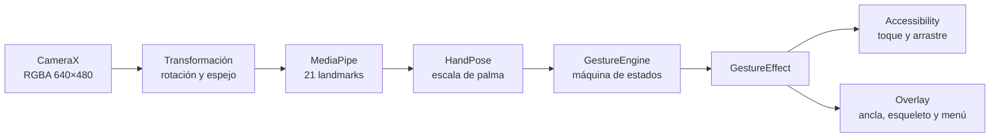

# Arquitectura técnica

## Objetivo

BioGesture separa cámara, coordenadas, clasificación, estado y acciones Android. La separación evita que una corrección de rotación cambie accidentalmente el significado de una pinza o que una pérdida de cámara deje un arrastre activo.

## Flujo de datos

## Componentes

### `HandTrackingPipeline`

- Ejecuta MediaPipe en modo `VIDEO` y delegado CPU.
- Procesa una mano con confianza 0.55/0.55/0.50.
- Reutiliza buffers RGBA para reducir asignaciones.
- Limita las inferencias a 12, 20 o 30 FPS.
- Reduce a 10/6 FPS según el estado térmico y a 6 FPS en reposo.
- Solo produce una vista previa durante la calibración.

### `LandmarkCoordinateTransform`

Normaliza los landmarks del buffer de cámara a la orientación lógica de pantalla. Es el punto único en el que se compensa `ROTATION_0/90/180/270`, evitando el error histórico de 90° y el eje vertical invertido.

### `ScreenCoordinateMapper`

Convierte coordenadas normalizadas en píxeles dentro del área segura de Android. Aplica una sola vez:

1. calibración de la orientación activa;
2. espejo configurado;
3. recorte a límites válidos;
4. insets de barras y recortes.

### `HandPose` y `HandPoseClassifier`

`HandPose` ofrece distancias normalizadas por la escala de palma. El clasificador reconoce V y pose de apertura del menú usando geometría relativa, no píxeles absolutos.

### `GestureEngine`

Máquina de estados independiente de Android. Sus salidas son efectos tipados y no acciones del sistema. Invariantes:

- histéresis separada para cerrar y liberar pinzas;
- clic 4–8 únicamente tras una liberación confirmada;
- arrastre después de 300 ms, sin clic residual;
- contexto 4–12 enclavado hasta liberar;
- V reservada y sostenida tres segundos;
- pérdidas inferiores a 350 ms no rompen arrastre o menú;
- candidatos incompletos se cancelan ante una pérdida para impedir clics fantasma.

### `AccessibilityGestureDispatcher`

Serializa gestos de accesibilidad. Un arrastre se compone de segmentos enlazados con `willContinue`, y siempre dispone de una ruta de finalización por liberación, pérdida, pausa, rotación o interrupción.

### Menú radial

`RadialMenuCatalog` define ocho niveles tipados. `RadialMenuController` controla geometría, progreso, selección, recentrado y navegación. `RadialMenuView` solo dibuja el estado recibido.

### `BioGestureService`

Integra cámara, ciclo de vida, overlays, temperatura, rotación y acciones Android. El análisis se serializa en `BioGesture-Vision`; la interfaz y las acciones se aplican en el hilo principal.

## Rotación

Al cambiar la pantalla:

1. termina cualquier arrastre;
2. cierra el menú;
3. cancela calibración activa;
4. incrementa la época de coordenadas;
5. actualiza resolución, insets y rotación de CameraX;
6. descarta fotogramas de la época anterior;
7. carga la calibración vertical u horizontal correspondiente.

## Rendimiento

La resolución de análisis permanece en 640×480 porque el landmark model obtiene poca ventaja práctica de fotogramas mayores en este uso, mientras la conversión y el ancho de memoria sí aumentan. El perfil seleccionado es un presupuesto máximo; la política térmica puede reducirlo.

## Pruebas

Las pruebas JVM cubren clasificación, estado, calibración, transformación, geometría, catálogo, selección radial, FPS y volumen. La lista física está en [PRUEBAS_EN_TELEFONO.md](PRUEBAS_EN_TELEFONO.md).
