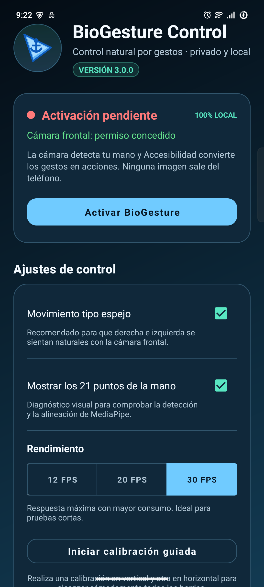
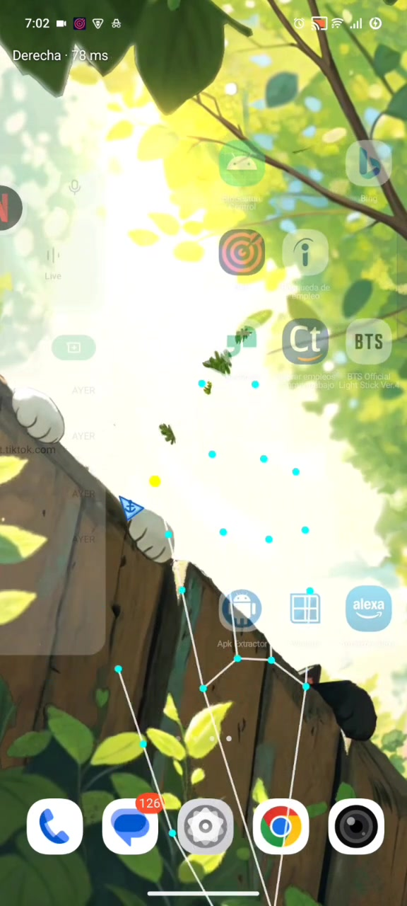
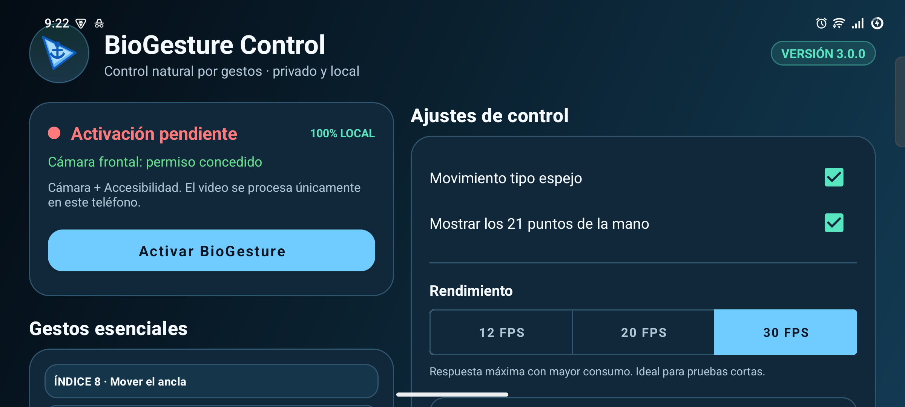
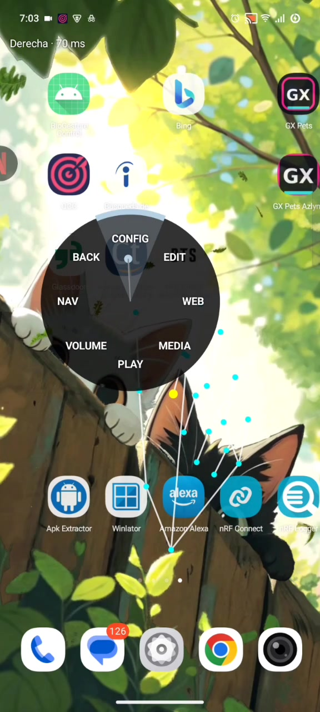
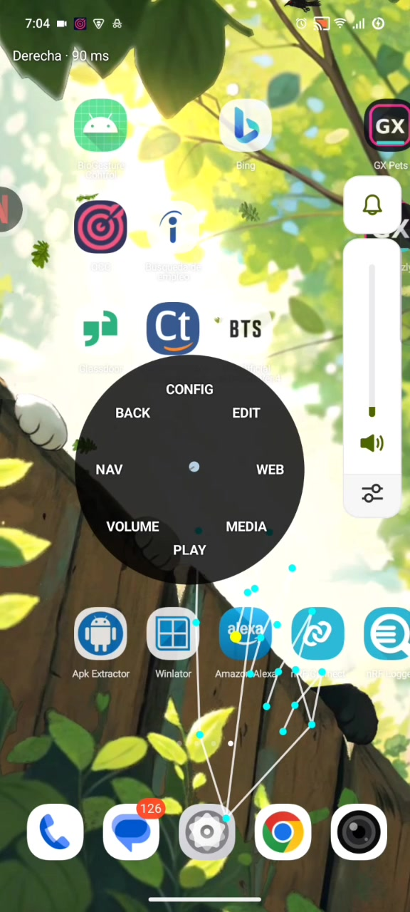

# Manual de usuario — BioGesture Control Android 3.0.0

> Controla Android con una mano mediante la cámara frontal, MediaPipe y el servicio de Accesibilidad del sistema.



## Índice

1. [Antes de instalar](#1-antes-de-instalar)
2. [Descarga segura del APK](#2-descarga-segura-del-apk)
3. [Instalación paso a paso](#3-instalación-paso-a-paso)
4. [Primera activación](#4-primera-activación)
5. [Preparar el espacio](#5-preparar-el-espacio)
6. [Calibración vertical y horizontal](#6-calibración-vertical-y-horizontal)
7. [Panel principal](#7-panel-principal)
8. [Referencia completa de gestos](#8-referencia-completa-de-gestos)
9. [Menú radial y submenús](#9-menú-radial-y-submenús)
10. [Perfiles de rendimiento y temperatura](#10-perfiles-de-rendimiento-y-temperatura)
11. [Uso horizontal](#11-uso-horizontal)
12. [Privacidad y Accesibilidad](#12-privacidad-y-accesibilidad)
13. [Solución de problemas](#13-solución-de-problemas)
14. [Desactivar o desinstalar](#14-desactivar-o-desinstalar)

---

## 1. Antes de instalar

### Requisitos

- Android 10 o posterior.
- Cámara frontal funcional.
- Aproximadamente 120 MB libres para descarga, instalación y optimización de Android.
- Permiso para instalar aplicaciones desde el navegador o administrador de archivos utilizado.
- Posibilidad de activar un servicio de Accesibilidad.

### Qué hace la aplicación

BioGesture recibe fotogramas de la cámara frontal, obtiene 21 landmarks de una mano y conserva únicamente sus coordenadas temporales. Una máquina de estados decide si la pose significa mover el cursor, tocar, arrastrar, abrir el menú o entrar en reposo. Android ejecuta la acción mediante Accesibilidad.

### Qué no hace

- No graba video.
- No guarda fotografías.
- No envía imágenes o landmarks a un servidor.
- No requiere una cuenta.
- No incluye publicidad ni analítica.

### Aviso importante

Accesibilidad es una capacidad sensible. Instala únicamente la APK publicada en el repositorio oficial y desactiva el servicio cuando no vayas a utilizarlo. BioGesture es una herramienta experimental de interacción; no debe ser el único medio para operar funciones críticas o de emergencia.

---

## 2. Descarga segura del APK

1. Abre la página oficial de [Releases](https://github.com/Luics415/Bio-Gesture-Control-Android/releases/latest).
2. Despliega **Assets**.
3. Descarga `BioGesture-Control-v3.0.0.apk`.
4. Descarga también `BioGesture-Control-v3.0.0.sha256`.

Para comprobar la suma en Windows:

```powershell
Get-FileHash .\BioGesture-Control-v3.0.0.apk -Algorithm SHA256
```

El resultado debe coincidir exactamente con el archivo `.sha256` de la release. Si no coincide, elimina la APK y vuelve a descargarla del repositorio oficial.

---

## 3. Instalación paso a paso

### Instalación normal

1. Abre la APK descargada.
2. Si Android pregunta si el navegador o administrador puede instalar aplicaciones desconocidas, entra en **Ajustes** y habilita **Permitir desde esta fuente** únicamente para esa aplicación.
3. Regresa al instalador.
4. Pulsa **Instalar**.
5. Al finalizar, pulsa **Abrir**.

### Si Android indica que la aplicación fue bloqueada

Algunas versiones de Android y capas de fabricantes protegen especialmente las aplicaciones instaladas fuera de Play Store que solicitan Accesibilidad.

1. Abre **Ajustes → Aplicaciones → BioGesture Control**.
2. Abre el menú de tres puntos de la pantalla de información de la aplicación.
3. Si aparece, selecciona **Permitir ajustes restringidos**.
4. Confirma con PIN, patrón o huella.
5. Regresa a BioGesture y vuelve a abrir Accesibilidad.

En Vivo/Funtouch OS los nombres pueden variar entre **Permisos especiales**, **Instalar aplicaciones desconocidas**, **Ajustes restringidos** o **Más ajustes de seguridad**.

### Actualización

Una APK solo puede actualizar otra instalación si el identificador y la firma coinciden. La versión oficial 3.0.0 inicia la línea de firma estable. Si venías de una compilación 2.x de prueba firmada por Android Studio y aparece “No se pudo instalar”:

1. desactiva el servicio de BioGesture;
2. desinstala la compilación de prueba;
3. instala la APK oficial;
4. activa de nuevo los permisos y calibra.

Después de instalar 3.0.0, las siguientes APK oficiales podrán actualizarla conservando datos siempre que mantengan la firma oficial.

---

## 4. Primera activación

El panel superior indica el estado real de los dos requisitos.

### Paso 1 — Cámara

1. Pulsa **Conceder acceso a la cámara**.
2. Elige **Mientras la aplicación está en uso**.
3. El texto debe cambiar a **Cámara frontal: permiso concedido**.

La cámara se mantiene activa mediante una notificación de primer plano cuando el servicio está funcionando.

### Paso 2 — Accesibilidad

1. Pulsa **Activar BioGesture**.
2. Localiza **BioGesture Control** dentro de servicios instalados o aplicaciones descargadas.
3. Actívalo.
4. Lee y acepta la advertencia de Android.
5. Regresa a BioGesture.

El panel debe mostrar un punto verde y **Sistema listo**.

### Paso 3 — Perfil inicial

Selecciona **20 FPS**, el perfil equilibrado recomendado. Usa 12 FPS si notas calentamiento o necesitas una sesión larga; reserva 30 FPS para máxima respuesta y pruebas cortas.

### Paso 4 — Diagnóstico opcional

Activa **Mostrar los 21 puntos de la mano** durante la primera configuración. Cuando confirmes que los puntos siguen la mano, puedes desactivarlo para una pantalla más limpia y menor trabajo de dibujo.

---

## 5. Preparar el espacio

La visión por computadora depende del encuadre. Antes de calibrar:

- limpia la cámara frontal;
- evita una ventana o foco intenso detrás de la mano;
- usa iluminación frontal o lateral uniforme;
- mantén la mano completa dentro del campo de visión;
- separa la mano del fondo cuando sea posible;
- evita mangas, objetos o la otra mano sobre los dedos;
- comienza a una distancia aproximada de 35 a 70 cm y ajusta hasta ver los 21 puntos estables;
- presenta la palma hacia la cámara para la mayoría de gestos.

No es necesario mantener el brazo completamente rígido. El filtro adaptativo estabiliza movimientos pequeños sin impedir desplazamientos rápidos deliberados.



---

## 6. Calibración vertical y horizontal

La calibración adapta el recorrido cómodo de tu dedo al área útil de la pantalla. BioGesture guarda dos perfiles independientes.

### Calibración vertical

1. Coloca el teléfono vertical.
2. Abre BioGesture.
3. Pulsa **Iniciar calibración guiada**.
4. Regresa a la pantalla que quieras controlar.
5. Durante seis segundos, recorre con la punta del índice las cuatro esquinas que puedas alcanzar sin sacar la mano del encuadre.
6. Mantén un movimiento continuo y pasa también por los bordes.
7. Espera la confirmación de calibración guardada.

### Calibración horizontal

1. Gira el teléfono a horizontal y espera a que la interfaz se acomode.
2. Repite los mismos pasos.
3. Prueba ambas esquinas superiores y ambas inferiores.



### Cuándo repetirla

- si cambias la posición habitual del teléfono;
- si el cursor no alcanza un borde;
- si cambias mucho la distancia a la cámara;
- si otra persona va a usar el control;
- después de borrar datos de la aplicación.

La aplicación descarta valores extremos aislados. Si detecta pocas muestras o un recorrido insuficiente, conserva la calibración anterior.

---

## 7. Panel principal

### Estado

- **Sistema listo**: cámara y servicio preparados.
- **Activación pendiente**: falta activar Accesibilidad.
- **Cámara frontal: permiso pendiente**: falta conceder cámara.
- **100% LOCAL**: recordatorio de que el análisis no sale del teléfono.

### Movimiento tipo espejo

Activado es el comportamiento recomendado para la cámara frontal: mover físicamente la mano a la derecha mueve el cursor a la derecha desde la perspectiva del usuario. Desactívalo únicamente si necesitas coordenadas no reflejadas para un montaje especial.

### Mostrar los 21 puntos

Dibuja el esqueleto diagnóstico. Sirve para revisar rotación, mano visible y calidad del seguimiento. No cambia el reconocimiento de gestos.

### Rendimiento

- **12 FPS**: ahorro y menor temperatura.
- **20 FPS**: equilibrio predeterminado.
- **30 FPS**: latencia mínima, mayor consumo.

El valor es un máximo. Android puede reducirlo automáticamente si el teléfono se calienta.

### Manual y GitHub

Abren en el navegador este manual y el repositorio oficial. BioGesture no integra un navegador ni envía información al abrirlos.

---

## 8. Referencia completa de gestos

Los números siguen la numeración estándar de MediaPipe:

- `4`: punta del pulgar;
- `8`: punta del índice;
- `12`: punta del dedo medio.

### Mover el ancla

**Acción:** presenta una mano visible sin un gesto reservado.  
**Control:** el landmark `8` mueve la punta exacta del ancla azul.  
**Consejo:** mueve primero la mano lentamente para confirmar la escala y después acelera.

### Clic principal — pinza 4–8

1. Junta la punta del pulgar (`4`) con la del índice (`8`).
2. Mantén la pinza más de 60 ms pero menos de 300 ms.
3. Separa los dedos de forma clara.

El toque se emite al confirmar la liberación. Una pinza demasiado corta, ambigua o perdida no genera un clic fantasma.

### Arrastre — pinza 4–8 sostenida

1. Junta `4–8` sobre el punto inicial.
2. Mantén la pinza al menos 300 ms.
3. Sin separar los dedos, mueve la mano.
4. Separa la pinza para soltar.

El arrastre usa segmentos enlazados de Accesibilidad para mantener una única pulsación virtual. Si la mano desaparece menos de 350 ms, conserva el arrastre; si la pérdida continúa, lo finaliza de forma segura.

### Acción contextual — pinza 4–12

1. Junta pulgar (`4`) y medio (`12`).
2. Mantén al menos 100 ms.
3. Libera antes de repetir.

BioGesture intenta una acción contextual o pulsación larga. La respuesta depende de la aplicación y del elemento situado bajo el cursor.

### Lectura ambigua

Si `4–8` y `4–12` parecen cerradas a la vez, BioGesture no elige ninguna. Debes separar los dedos y comenzar de nuevo. Esta regla evita ejecutar dos acciones por una sola postura.

### Reposo y reactivación — V de tres segundos

1. Extiende índice y medio formando una V.
2. Mantén anular y meñique cerrados.
3. Sostén tres segundos.

Al entrar en reposo:

- se cancelan clics, arrastre, contexto y menú;
- el ancla queda tenue como señal visual;
- el análisis baja a 6 FPS;
- la cámara permanece preparada para reconocer la reactivación.

Para reactivar, libera primero la V y vuelve a mantenerla tres segundos. La misma V sostenida no alterna repetidamente.

### Abrir menú radial — pulgar

1. Extiende el pulgar.
2. Mantén índice, medio, anular y meñique cerrados.
3. Sostén la pose 800 ms.

Una vez abierto, ya no necesitas conservar la pose estricta. Mueve el pulgar hacia una opción y mantenlo 750 ms.

---

## 9. Menú radial y submenús



### Regla de selección

1. El centro aparece marcado.
2. Mueve el pulgar fuera del centro hacia un sector.
3. El arco visible muestra el progreso de 750 ms.
4. Al completar el arco, se ejecuta la acción o se abre el submenú.
5. Regresa el pulgar al centro iluminado para rearmar una nueva selección.

Mantener el pulgar sobre el mismo sector después de ejecutar no repite la acción. Esto evita cambios múltiples de volumen, navegación duplicada o aperturas accidentales.

### Cerrar

- Elige **BACK** en PRINCIPAL.
- Forma una V para iniciar el control de reposo.
- Retira la mano durante más de 350 ms.

**VOLVER** dentro de un submenú regresa a PRINCIPAL; no cierra toda la interfaz.

### PRINCIPAL

| Sector | Función |
|---|---|
| CONFIG | Ajustes, permisos, diagnóstico y calibración. |
| EDIT | Edición de texto accesible. |
| WEB | Navegación y desplazamiento. |
| MEDIA | Controles multimedia generales. |
| PLAY | Reproducir o pausar por separado. |
| VOLUME | Volumen multimedia. |
| NAV | Navegación global de Android. |
| BACK | Cerrar el menú. |

### CONFIG

| Opción | Resultado |
|---|---|
| AJUSTES | Abre los ajustes generales de Android. |
| PERMISOS | Abre la ficha de BioGesture. |
| GESTOS | Alterna el dibujo de los 21 puntos. |
| CALIBRAR | Inicia la calibración guiada. |
| VOLVER | Regresa a PRINCIPAL. |

### EDIT

| Opción | Resultado |
|---|---|
| COPIAR | Copia la selección del campo enfocado. |
| PEGAR | Pega en el campo enfocado. |
| TODO | Selecciona todo el texto accesible. |
| CORTAR | Corta la selección. |
| VOLVER | Regresa a PRINCIPAL. |

Estas acciones requieren un campo de texto y soporte de Accesibilidad en la aplicación activa.

### WEB

| Opción | Resultado |
|---|---|
| ATRAS | Acción global Atrás. |
| ADELANTE | Depende del control publicado por el navegador. |
| SCROLL UP | Desplaza el contenido hacia arriba. |
| SCROLL DN | Desplaza el contenido hacia abajo. |
| NUEVA T | Abre una nueva vista web con Google. |
| RECARGAR | Busca un control accesible Recargar/Actualizar. |
| CERRAR T | Usa Atrás como alternativa segura. |
| VOLVER | Regresa a PRINCIPAL. |

### MEDIA

| Opción | Resultado |
|---|---|
| PLAY/PAUSE | Envía la tecla multimedia correspondiente. |
| SIGUIENTE | Siguiente elemento multimedia. |
| ANTERIOR | Elemento multimedia anterior. |
| FULLSCREEN | Ejecuta un gesto vertical compatible con algunos reproductores. |
| ADELAN 10s | Doble toque en el lado derecho. |
| ATRAS 10s | Doble toque en el lado izquierdo. |
| VOLVER | Regresa a PRINCIPAL. |

### PLAY

- **PLAY**: tecla multimedia Reproducir.
- **PAUSE**: tecla multimedia Pausar.
- **VOLVER**: regresa a PRINCIPAL.

### VOLUME

- **SUBIR**: aumenta un nivel del canal multimedia.
- **BAJAR**: reduce un nivel.
- **MUTE**: guarda el nivel y silencia; una segunda selección restaura el nivel guardado.
- **VOLVER**: regresa a PRINCIPAL.

BioGesture fija el índice real de `STREAM_MUSIC`, espera 120 ms, vuelve a leerlo y muestra el porcentaje aplicado. Si el fabricante impide el cambio, muestra un aviso en lugar de asumir que funcionó.



### NAV

- **ATRAS**: Atrás global.
- **INICIO**: pantalla de inicio.
- **RECIENTES**: selector de aplicaciones recientes.
- **NOTIF**: abre las notificaciones.
- **VOLVER**: regresa a PRINCIPAL.

---

## 10. Perfiles de rendimiento y temperatura

| Perfil | Inferencias máximas | Uso recomendado |
|---|---:|---|
| Ahorro | 12 FPS | Sesiones largas, batería, teléfonos modestos. |
| Equilibrado | 20 FPS | Uso diario y primera configuración. |
| Precisión | 30 FPS | Respuesta rápida, pruebas breves y buena refrigeración. |
| Reposo | 6 FPS | Espera de la V de reactivación. |

Cuando Android informa temperatura moderada, BioGesture reduce el presupuesto; con temperatura severa baja a 6 FPS. Si la cámara rechaza un rango solicitado, vuelve a su configuración segura. Ante un fallo de reconfiguración realiza tres reintentos y nunca deja un arrastre activo.

### Reducir calentamiento

- usa 12 o 20 FPS;
- oculta los 21 puntos cuando no los necesites;
- evita cargar el teléfono durante una sesión larga;
- quita fundas muy aislantes;
- no uses el dispositivo bajo sol directo;
- activa reposo durante pausas breves;
- desactiva el servicio al terminar.

---

## 11. Uso horizontal

La interfaz principal usa dos columnas en horizontal. El núcleo ajusta rotación de cámara, insets, calibración y geometría del menú sin sacrificar el perfil vertical.

Al girar durante una interacción:

- un arrastre termina de forma segura;
- el menú se cierra;
- una calibración se cancela;
- se descartan fotogramas de la orientación anterior.

Espera un instante después de girar y vuelve a presentar la mano. No intentes mantener una pinza durante la transición.

---

## 12. Privacidad y Accesibilidad

La notificación **BioGesture activo** indica que la cámara frontal está en uso. El procesamiento se ejecuta en el dispositivo con MediaPipe. Consulta la [política de privacidad](../PRIVACY.md) para el detalle de datos y permisos.

Accesibilidad permite:

- ejecutar toques, arrastres y swipes;
- usar Atrás, Inicio, Recientes y Notificaciones;
- localizar controles o campos que publiquen acciones accesibles;
- copiar, pegar y seleccionar en el elemento enfocado.

BioGesture no debe utilizarse para controlar el dispositivo de otra persona sin su autorización.

---

## 13. Solución de problemas

### La APK no se instala

- Confirma que es compatible con Android 10 o posterior.
- Vuelve a descargar y compara SHA-256.
- Permite instalaciones desde la fuente elegida.
- Si existe una compilación 2.x con otra firma, desinstálala primero.
- Comprueba que haya espacio libre.

### El servicio no aparece o está bloqueado

- Revisa **Ajustes → Aplicaciones → BioGesture Control → menú de tres puntos → Permitir ajustes restringidos**.
- Vuelve a Accesibilidad y busca servicios descargados.
- Reinicia Ajustes si acabas de actualizar la APK.

### No aparece el cursor

- Comprueba **Sistema listo**.
- Revisa la notificación de cámara.
- Activa temporalmente los 21 puntos.
- Mejora la luz y muestra la mano completa.
- Evita que otra aplicación use la cámara frontal.

### Los puntos están desplazados

- Limpia la lente.
- Mantén la palma orientada a cámara.
- Calibra la orientación actual.
- Comprueba el interruptor espejo.
- Gira el teléfono por completo y espera la nueva geometría.

### Arriba mueve a un lado

La versión 3.0.0 corrige el antiguo error de rotación. Si reaparece, registra orientación, modelo, Android y una captura con los landmarks; desactiva/reactiva el servicio para forzar una nueva vinculación de cámara.

### El clic funciona pero el arrastre se suelta

- Mantén `4–8` más de 300 ms antes de moverte.
- No ocultes el pulgar o índice.
- Reduce velocidad y mejora la iluminación.
- Comprueba que la aplicación destino acepte un arrastre de Accesibilidad.

### El menú se cierra

- Mantén la mano dentro de cámara; una pérdida sostenida cierra el menú.
- No hagas V salvo que quieras cerrarlo/reposar.
- Después de abrir ya puedes relajar la pose; mueve únicamente el pulgar hacia el sector.

### El menú no selecciona otra opción

Regresa primero al centro iluminado. Esta pausa de recentrado es obligatoria para impedir repeticiones.

### El volumen muestra el panel pero no cambia

En 3.0.0 el nivel se escribe y se vuelve a leer. Comprueba el mensaje de porcentaje. Si aparece “Android no permitió cambiar el volumen”:

- asegúrate de no estar en una llamada;
- revisa si el dispositivo tiene volumen fijo o control parental;
- prueba con contenido multimedia activo;
- registra fabricante, Android y nivel anterior/posterior.

### El teléfono se calienta

Selecciona 12 FPS, oculta el diagnóstico, evita cargarlo y usa reposo. Android reducirá el procesamiento automáticamente si informa un estado térmico elevado.

### Las acciones web o multimedia no funcionan en una app

No todas las aplicaciones publican los mismos controles de Accesibilidad ni responden a teclas multimedia. Prueba la acción equivalente en otra aplicación y reporta el nombre/versión de la incompatible.

---

## 14. Desactivar o desinstalar

### Detener temporalmente

1. Abre **Ajustes → Accesibilidad → BioGesture Control**.
2. Desactiva el servicio.

Esto detiene la cámara, la notificación y el overlay.

### Borrar calibración y preferencias

Abre **Ajustes → Aplicaciones → BioGesture Control → Almacenamiento → Borrar datos**. Después deberás conceder permisos y calibrar de nuevo.

### Desinstalar

Desactiva primero el servicio y después desinstala desde la ficha de la aplicación. La acción no elimina archivos APK que hayas descargado manualmente.

---

## Soporte

Antes de abrir un reporte, ejecuta [PRUEBAS_EN_TELEFONO.md](PRUEBAS_EN_TELEFONO.md) y reúne:

- versión BioGesture;
- modelo exacto;
- versión de Android;
- perfil y orientación;
- mano izquierda/derecha;
- iluminación y distancia aproximada;
- pasos reproducibles;
- captura o video sin datos privados.

Repositorio y reportes: [Luics415/Bio-Gesture-Control-Android](https://github.com/Luics415/Bio-Gesture-Control-Android)

Copyright © 2026 Luics415. Publicado bajo [Apache License 2.0](../LICENSE).
